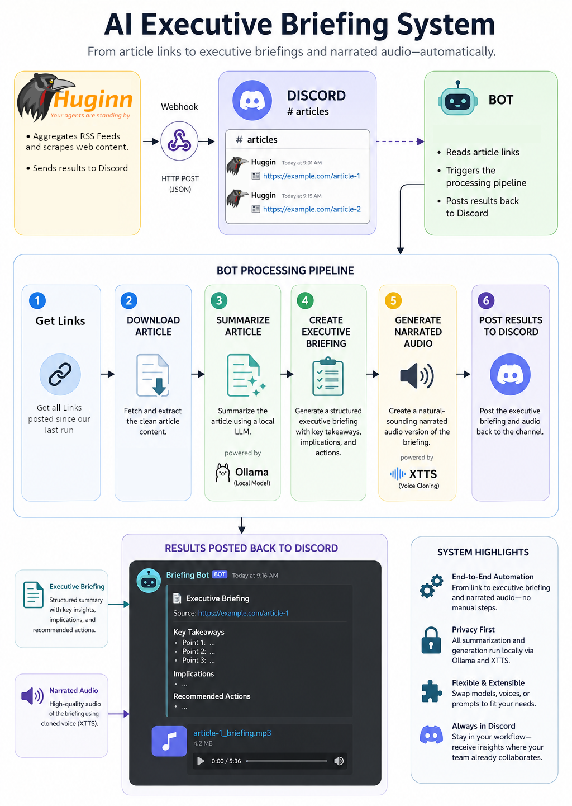

# Ollama Huggin Bridge

## Overview

This is a Cybersecurity news automation tool. It uses Ollama (Local LLMs) to digest and summarize threat intelligence blogs and extract actionable IOCs and TTPs. It also generates a 'news report' style executive breifing, that you can listen to while you're on the go. 

The project is designed to help security teams quickly review large numbers of threat intelligence and cybersecurity news articles without reading every source manually.

## What the Application Does



## Installation


Begin by installing [Python 3.11](https://www.python.org/downloads/)

Create a Virtual Environment
```bash
py -3.11 -m venv venv
```

Activate the Environment

Windows:

```powershell
.\venv\Scripts\activate 
```

Linux/macOS:

```bash
source venv/bin/activate
```

Install Dependencies

```bash
python -m pip install --upgrade pip
python -m pip install -r requirements.txt
```

Install FFmpeg

Windows:

```bash
winget install "FFmpeg (Essentials Build)"
```

Verify installation:

```bash
ffmpeg -version
```

[Install Ollama](https://ollama.com/)

Start Ollama and pull a model:

```bash
ollama run qwen3:4b
```

You may substitute another compatible model if desired.

## Configuration

Create a `.env` file in the project directory.

Example:

```env
APP_NAME=OllamaHugginBridge
APP_VERSION=0.0.1
APP_CACHE_DIR=cache
APP_DEBUG_OUTPUT=False

DISCORD_READ_CHANNEL_ID=<source-channel-id>
DISCORD_WRITE_CHANNEL_ID=<destination-channel-id>
DISCORD_BOT_TOKEN=<discord-bot-token>

OLLAMA_MAX_CTX=16384
OLLAMA_RESERVED_OUTPUT=1024
```

### Discord Setup and Permissions

You will need to register a new bot application on the Discord Developer dashboard. 

https://discord.com/developers/applications

1. Click New Application.
2. Open Bot → Add Bot.
3. Copy the Bot Token
4. Under OAuth2 → URL Generator, select:
 - Scopes: bot
 - Bot Permissions: required permissions
    - Read messages
    - Read message history
    - Send messages
    - Upload files

5. Open the generated invite URL.
6. Select your server and authorize.
7. Start your bot using the token.

When you setup your server, You will need to dedicate 2 channels
- A channel to dump RSS feed data into
- A channel to upload executive summaries to

For your RSS dump channel, setup a webhook that your huginn agents can post to. You can use the following Agent JSON to configure your Discord POST agent in Huginn. 

```
{
  "method": "post",
  "headers": {},
  "payload": {
    "embeds": [
      {
        "url": "{{url}}",
        "color": 5793266,
        "title": "{{title}}",
        "description": "{{description}}"
      }
    ],
    "content": "New Article Found",
    "username": "Threat Intelligence Bot",
    "avatar_url": "https://static.wikia.nocookie.net/hackers/images/8/8a/Acid_burn.jpg/revision/latest?cb=20150710211643"
  },
  "no_merge": true,
  "post_url": "[INSERT DISCORD WEBHOOK URL]",
  "parse_body": false,
  "emit_events": false,
  "output_mode": "clean",
  "content_type": "json",
  "expected_receive_period_in_days": 1
}
```

Update your .env file with the channel IDs of your two channels and the secret token of your new bot. 

## Voice Cloning

The application expects a reference voice sample at:

```text
voice-samples/voice-sample3.1m.wav
```

Replace this file with your preferred speaker sample. Your sample should be between 30 seconds and 1 minute; and should contain uninterrupted speech audio from your desired speaker.  

The XTTS model used is:

```text
tts_models/multilingual/multi-dataset/xtts_v2
```

## Running the Application

Process articles from the last day:

```bash
python main.py --days 1
```

Additional options:

```bash
python main.py ^
  --days 7 ^
  --max-threads 8 ^
  --thread-timeout 60 ^
  --model-name qwen3:4b
  --debug 1
```

## Known Limitations

Some websites load article content dynamically using JavaScript frameworks such as React.

In those cases, the current implementation may retrieve incomplete content because it relies primarily on the `requests` library.

A future enhancement would be integrating a headless browser solution to render pages before extraction.

## Intended Use Case

This project is intended for:

- Security Operations Centers (SOC)
- Threat Intelligence Teams
- Cybersecurity Analysts
- Incident Responders
- Security Managers who require executive briefings
